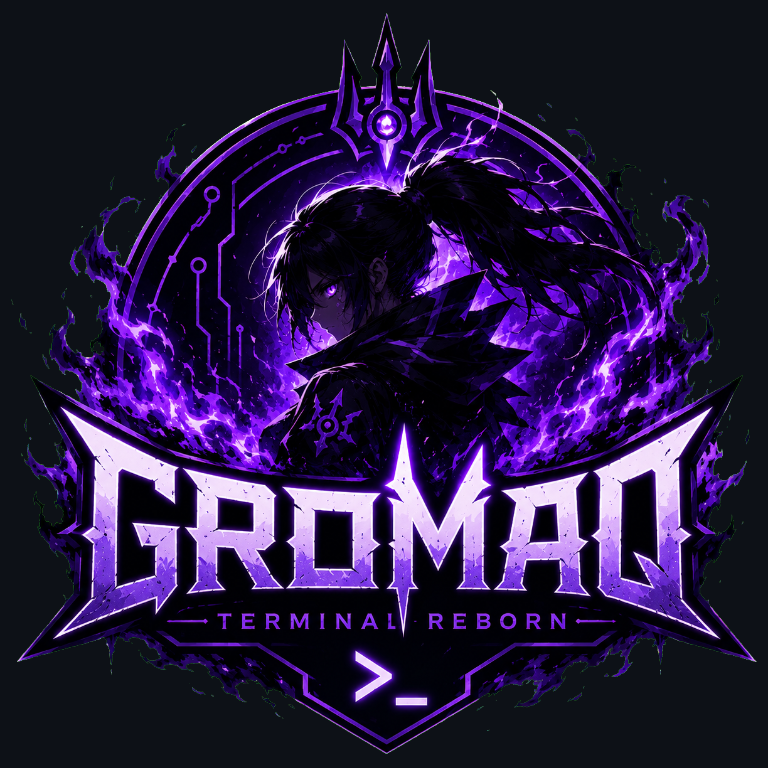
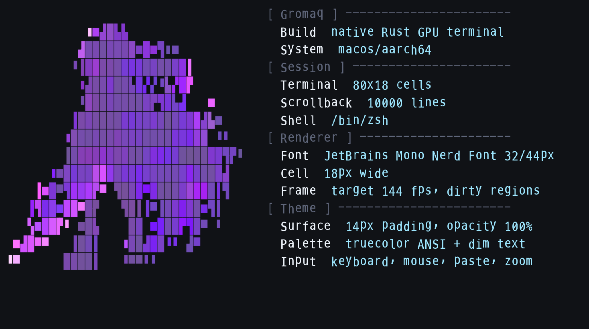

# Gromaq



Gromaq is a native Rust GPU terminal emulator for `gromaq.dev`.

The project is intentionally native: Rust, `winit`, `wgpu`, real PTYs, and no
Electron, webview, React, or browser UI runtime. It is currently in an alpha
foundation stage. The core terminal state, PTY boundary, theme system, font
rasterization, GPU presentation path, performance smokes, and compatibility
tests are under active development, but broader daily-driver proof across
machines and workflows is still in progress.



## Install

The current installer builds from source with Cargo. It works on normal macOS
and Linux development machines that already have Rust stable installed.

```bash
curl -fsSL https://raw.githubusercontent.com/vicotrbb/gromaq/main/scripts/install.sh | sh
```

Manual install:

```bash
git clone https://github.com/vicotrbb/gromaq.git
cd gromaq
cargo install --path . --locked
```

Run:

```bash
gromaq
```

Inspect command-line metadata:

```bash
gromaq --help
gromaq --version
```

Requirements:

- Rust stable with Cargo
- macOS or a Linux desktop session with GPU drivers available to `wgpu`
- A login shell such as `zsh`, `bash`, or another configured shell

The one-command installer is deliberately small and auditable. It does not
install Rust or system packages for you; if Cargo is missing, install Rust from
your package manager or `https://rustup.rs`, then run the command again.
Preview the actions without installing or writing files:

```bash
curl -fsSL https://raw.githubusercontent.com/vicotrbb/gromaq/main/scripts/install.sh | GROMAQ_DRY_RUN=1 sh
```

Linux users can opt into the prebuilt release tarball path once a tagged
release has published GitHub Release assets:

```bash
curl -fsSL https://raw.githubusercontent.com/vicotrbb/gromaq/main/scripts/install.sh | GROMAQ_INSTALL_METHOD=release GROMAQ_VERSION=v0.1.0 sh
```

This downloads `gromaq-<version>-linux-<arch>.tar.gz`, installs the binary into
`${GROMAQ_BIN_DIR:-${CARGO_HOME:-~/.cargo}/bin}`, and installs the Linux desktop
identity assets from the tarball. By default it also downloads
`SHA256SUMS-linux-<arch>` and verifies the tarball before extraction. Set
`GROMAQ_VERIFY_CHECKSUMS=0` only for local mirror/debug scenarios where you have
another integrity check. The release method is locally proven against a
file-backed tarball; it still needs live GitHub Release asset proof from a tag
run before becoming the default installer path.

On Linux, the installer also installs user-local desktop assets by default:
`dev.gromaq.Gromaq.desktop`, the project icon under the hicolor icon theme, and
AppStream metainfo under `${XDG_DATA_HOME:-~/.local/share}`. Set
`GROMAQ_INSTALL_DESKTOP_ASSETS=0` to install only the binary. When
`update-desktop-database` is available, the installer refreshes the Linux
desktop database for the installed applications directory and reports the
refresh path.

Maintainers can prove Linux desktop asset placement and Linux desktop database
refresh when `update-desktop-database` is available without network or home
directory writes:

```bash
GROMAQ_SKIP_CARGO_INSTALL=1 GROMAQ_PLATFORM=Linux \
  GROMAQ_ASSET_ROOT="$PWD" GROMAQ_INSTALL_ROOT=target/install-proof \
  sh scripts/install.sh
```

On macOS, source install gives you the `gromaq` binary. To build a `.app` bundle
with the project logo as the Dock/app icon from a checked-out repository, run:

```bash
scripts/package-macos-app.sh
open target/dist/Gromaq.app
```

To sign the bundle during packaging, set `GROMAQ_CODESIGN_IDENTITY`. Use `-`
for local ad-hoc signing, or a Developer ID Application identity for release
signing:

```bash
GROMAQ_CODESIGN_IDENTITY=- scripts/package-macos-app.sh
```

To notarize a signed release bundle, provide a notarytool keychain profile or
Apple ID credentials:

```bash
GROMAQ_NOTARY_KEYCHAIN_PROFILE=gromaq scripts/notarize-macos-app.sh target/dist/Gromaq.app
```

The one-command installer can also install a user-local `.app` bundle when run
on macOS:

```bash
curl -fsSL https://raw.githubusercontent.com/vicotrbb/gromaq/main/scripts/install.sh | GROMAQ_INSTALL_APP_BUNDLE=1 sh
```

By default this copies `Gromaq.app` to `~/Applications`. Set
`GROMAQ_MACOS_APP_DIR=/path/to/apps` to choose another destination.

Release artifact helpers:

```bash
scripts/package-linux-tarball.sh
scripts/package-debian-deb.sh
scripts/package-macos-app.sh
scripts/prove-macos-app-identity.sh
scripts/prove-debian-package.sh
scripts/prove-linux-release-install.sh
scripts/prove-github-release-install.sh
scripts/prove-linux-desktop-discovery.sh
scripts/prove-144hz-window-perf.sh
scripts/prove-arch-package.sh
bash -n packaging/arch/PKGBUILD
sh -n packaging/arch/gromaq.install
```

`packaging/arch/PKGBUILD`, `packaging/arch/.SRCINFO`, and
`packaging/arch/gromaq.install` provide an Arch `makepkg` source-package recipe
that builds from the public Git repository, installs the binary, desktop file,
AppStream metainfo, hicolor icon, README, and license, and refreshes desktop
metadata from Arch package install/upgrade/remove hooks when the relevant
desktop utilities are available. CI and repository policy syntax-check the
recipe. On 2026-06-27, CI run `28303175039` completed green for commit `12a38e8`,
including the
`arch-packaging` job under `archlinux:base-devel` that ran
`makepkg --nobuild` and `makepkg --printsrcinfo` as an unprivileged builder
user. On 2026-06-28 UTC, CI run `28308158338` completed green for commit
`5d204f2`; its `arch-packaging` job continued through full
`makepkg --noconfirm`, `pacman -U` package installation, `gromaq --version`,
and `pacman -Ql` payload checks for the binary, README, license, desktop file,
AppStream metainfo, and hicolor icon.
Maintainers with a working Docker daemon can run
`scripts/prove-arch-package.sh` to reproduce the full Arch build, package
install, `gromaq --version`, and installed-payload checks in an
`archlinux:base-devel` container.

Tagged releases and manual workflow runs use `.github/workflows/release.yml` to
upload a Linux tarball, a Debian `.deb` package, the Arch `PKGBUILD` plus
`.SRCINFO` plus `gromaq.install`, and a zipped macOS `.app` bundle as GitHub
Actions artifacts.
Tag-triggered runs also create or reuse the matching GitHub Release and upload
release assets. The remote GitHub Actions release workflow completed green on
2026-06-27 as run `28303243197` for commit `12a38e8`, uploading the Linux
tarball, Debian package, Arch `PKGBUILD`, hidden `.SRCINFO`, macOS `.app` zip,
and checksum manifests as workflow artifacts. The downloaded macOS zip includes
an app `Info.plist` with `LSApplicationCategoryType=public.app-category.utilities`.
Tag-triggered GitHub Release asset publication is configured but still needs a
live tag-run proof.
CI also runs a focused Ubuntu packaging job for repository policy and Linux
installer asset placement plus Linux tarball and Debian package assembly. The
job is now configured for Debian package install, `gromaq --version`, and installed-payload checks.
It then runs `scripts/prove-linux-release-install.sh`
with Arch metadata checksum extras so the locally generated Linux release
tarball, checksum manifest, binary install, and desktop identity payloads are
verified before accepting packaging success. The checksum script also accepts
`GROMAQ_CHECKSUM_EXTRA_FILES="packaging/arch/PKGBUILD packaging/arch/.SRCINFO packaging/arch/gromaq.install"`,
and the Linux packaging and release workflows use that path so the Arch recipe
metadata is covered by the Linux checksum manifest when it is uploaded. CI run `28309262840` completed green for commit `461006d`, including the
helper-backed Linux packaging proof, Debian package install and payload checks,
Arch package build/install proof, and the full macOS Rust smoke suite.
CI run
`28303175039` completed green for commit `12a38e8`, including that checksum
path, Debian package assembly, and the release-method tarball install step on
Ubuntu; the macOS job passed the packaging test that inspects the `.deb` member
structure.
Release artifacts include a `SHA256SUMS` manifest.
The Debian package includes Debian `postinst`/`postrm` desktop refresh hooks
that conditionally run `update-desktop-database` and refresh the hicolor icon
cache when those desktop utilities are available. On Debian/Ubuntu hosts,
maintainers can run `scripts/prove-debian-package.sh` to build the `.deb`,
install it with `dpkg -i`, run `/usr/bin/gromaq --version`, and record
installed-payload checks.
On Linux hosts, `scripts/prove-linux-release-install.sh` packages the release
tarball, writes checksums, installs through `GROMAQ_INSTALL_METHOD=release`
from a local `file://` release base, and verifies the binary plus desktop
identity payloads under `target/release-install-proof`.
On Linux desktop hosts with `desktop-file-validate`, `appstreamcli`,
`update-desktop-database`, and `gtk-update-icon-cache` available,
`scripts/prove-linux-desktop-discovery.sh` installs the desktop identity
payloads into an isolated proof root, validates the `.desktop` and AppStream
metadata, refreshes the desktop database and hicolor icon cache there, and
records that this metadata/cache proof does not prove live menu UI rendering.
After a tagged GitHub Release publishes the Linux tarball and
`SHA256SUMS-linux-<arch>` assets, Linux maintainers can run
`scripts/prove-github-release-install.sh` to exercise the real GitHub Release
download path into `target/github-release-install-proof`; this live proof has
not passed yet.

## Status

Implemented and covered by automated tests or deterministic smoke commands:

- terminal grid/state, scrollback, resize reflow, alternate screen, selection,
  clipboard boundaries, OSC title/label/8/52 handling, and terminal-generated
  responses
- broad ANSI/VT parsing coverage including SGR colors and attributes, DEC modes,
  cursor movement, tab stops, editing commands, mouse reporting, focus reports,
  bracketed paste, and Unicode wide/emoji cluster handling
- native PTY runtime with shell startup, input/output pump, resize propagation,
  large-output handling, command-output redraw proof, and external-tool workflow
  smoke coverage for available `ssh` and `kubectl`
- native `winit` app lifecycle, keyboard/mouse mapping, clipboard paste/copy,
  scrollback navigation, live config reload, text zoom, frame scheduling, FPS
  overlay, startup welcome screen, and generated logo window icon
- Swash-backed font rasterization, glyph atlas packing/cache, `wgpu` adapter and
  device bootstrap, offscreen GPU smokes, and presentable window-surface glyph
  frame path
- theme presets, opacity controls, deterministic theme snapshots, and default
  theme legibility gates
- Criterion benchmark harness and repository policy tests for native-only Rust,
  public metadata, docs, CI commands, and module-size discipline
- GitHub Actions release workflow that is configured to build and upload the
  Linux tarball, Debian `.deb`, Arch `PKGBUILD`/`.SRCINFO`/`gromaq.install`,
  and macOS `.app` release artifacts with SHA256SUMS manifests on tag and manual
  dispatch;
  remote proof covers the tarball, Debian package, Arch metadata, macOS `.app`,
  and checksum workflow-artifact uploads
- Linux desktop database refresh when `update-desktop-database` is available,
  with deterministic installer coverage and Ubuntu CI configured to install the
  desktop-file utility before the Linux install-root proof
- macOS `.app` ad-hoc signing support plus a notarization helper with dry-run
  archive proof

Not yet proven enough to call complete:

- live desktop OS paste-menu workflow
- hardware-backed 144 Hz frame pacing proof on a 144 Hz-capable display
- live desktop screenshot proof across supported platforms
- live tag-triggered GitHub Release asset publication
- live Linux release-method install from GitHub Release assets
- live Linux desktop menu UI discovery after install
- wider compatibility matrix coverage across shells, editors, multiplexers,
  pagers, remote workflows, and multiple hosts
- Developer ID signed/notarized macOS app distribution

Current proof details live in
[`documentation/compatibility.md`](documentation/compatibility.md).

## Quick Start

Developer run:

```bash
cargo run
```

Useful smoke commands:

```bash
cargo run -- --gpu-info
cargo run -- --gpu-smoke
cargo run -- --gpu-terminal-text-smoke
cargo run -- --welcome-image-snapshot target/gromaq-welcome-image.ppm
cargo run -- --runtime-real-shell-smoke
cargo run -- --runtime-real-shell-command-output-smoke
cargo run -- --runtime-tool-workflow-smoke
cargo run -- --runtime-perf-budget-smoke
cargo run -- --runtime-perf-p95-smoke
cargo run -- --runtime-text-zoom-smoke
cargo run -- --theme-legibility-smoke
cargo run -- --theme-preview-snapshot target/gromaq-theme-preview.ppm
cargo run -- --theme-preview-config path/to/gromaq.toml target/gromaq-theme-preview.ppm
cargo run -- --welcome-preview-snapshot target/gromaq-welcome-preview.ppm
node images/avatar/generate.mjs --check
scripts/prove-welcome-preview.sh
```

Current-host compatibility proof bundle:

```bash
scripts/prove-current-host-compatibility.sh
```

This records the host tool inventory, runs `cargo test --test pty -- --nocapture`,
and runs `cargo run -- --runtime-tool-workflow-smoke`, writing logs under
`target/compatibility-proof`. CI is configured to run the same helper in the
macOS `rust` job and upload `target/compatibility-proof/*` as the
`gromaq-current-host-compatibility-proof` artifact. CI is also configured with
a Linux compatibility job that installs common Ubuntu shell/editor/TUI tools,
runs the same helper, and uploads `gromaq-linux-compatibility-proof`;
that Linux job sets `GROMAQ_REQUIRED_COMPAT_TOOLS` so the proof fails if any
expected installed tool is absent. Helper-backed remote proof for both new
artifacts is pending the next pushed run.

Manual live-window screenshot proof on macOS:

```bash
scripts/capture-macos-window-proof.sh target/gromaq-live-window-proof.png
```

Manual hardware-backed 144 Hz window pacing proof:

```bash
scripts/prove-144hz-window-perf.sh
```

This runs `cargo run -- --window-perf-smoke`, records
`target/144hz-window-perf-proof/window-perf.log`, and fails unless the native
window reports a monitor refresh of at least `144000` mHz, an unrestricted
144 FPS frame target, zero dropped frames, and accepted frame pacing. It is
intentionally manual because CI and ordinary 60/120 Hz desktops are not valid
proof surfaces for the 144 Hz hardware requirement.

Manual packaged-app identity proof on macOS:

```bash
scripts/prove-macos-app-identity.sh
```

The screenshot script launches bounded `--window-screenshot-smoke`, locates the
visible `Gromaq` window through macOS window metadata, captures that specific
window under `target/`, and waits for the app process to exit. If macOS cannot
capture the window id directly, it can fall back to the detected window bounds,
then validates that the screenshot contains Gromaq's default terminal
background and foreground text colors before accepting it. Rejected captures
are removed. It is intentionally manual because desktop screenshots can include
local user state; if macOS cannot expose or capture the targeted window
content, the helper fails instead of accepting a desktop-only image.

Full local verification:

```bash
cargo fmt --check
git diff --check
cargo clippy --all-targets --all-features -- -D warnings
cargo test --all
cargo bench --bench parser_throughput -- --list
```

Run `cargo bench` when changing parser, PTY pump, render planning, glyph cache,
rasterization, frame preparation, or other measured hot paths.

## Configuration

Generate a full starter config:

```bash
gromaq --config-template > gromaq.toml
gromaq --config-check gromaq.toml
gromaq --config gromaq.toml
```

Example:

```toml
[terminal]
cols = 132
rows = 40
scrollback_lines = 4096

[shell]
program = "/bin/zsh"
args = ["-l"]
cwd = "/tmp"

[welcome]
enabled = true

[font]
family = "JetBrains Mono Nerd Font"
# fallback_families = ["Apple Color Emoji"]
size_px = 32.0
# cell_width_px = 18
line_height_px = 44.0

[theme]
# presets: gromaq-dark, gromaq-graphite, gromaq-ghostty
preset = "gromaq-ghostty"
background = "#101216"
foreground = "#eef4fb"
cursor = "#f6c177"
selection = "#2f3b52"
background_opacity = 1.0
cursor_opacity = 1.0
selection_opacity = 1.0
cursor_style = "block"
cursor_blinking = true
ansi = [
  "#242933", "#ff6b7a", "#9ece6a", "#e0af68",
  "#7aa2f7", "#bb9af7", "#7dcfff", "#c8d3e5",
  "#5f667a", "#ff8fa3", "#b9f27c", "#ffd98a",
  "#9dbdff", "#d7afff", "#9ee7ff", "#f7fbff",
]
surface_padding_px = 14
cell_spacing_px = 0
dim_opacity = 0.68

[performance]
target_fps = 144
dirty_region_rendering = true
```

`gromaq-ghostty` is the built-in default theme preset, with calm contrast and
expressive ANSI colors inspired by polished Ghostty setups. `gromaq-dark` keeps
the original polished dark palette, and `gromaq-graphite` is an alternate
high-contrast graphite preset.

Use these commands to inspect and export themes:

```bash
cargo run -- --theme-list
cargo run -- --theme-export gromaq-ghostty target/gromaq-theme.toml
```

A preset provides the baseline background, foreground, cursor, selection, ANSI
palette, cursor style, cursor blinking, background/cursor/selection opacity,
surface padding, optional cell spacing, and dim text opacity; every field in
`[theme]` can still be overridden directly in TOML. Use
`gromaq --theme-preview-config <config> <path>` to render a deterministic
preview snapshot from any TOML config, including background, cursor, and
selection opacity, before adopting it.

`[welcome].enabled = true` shows the built-in startup screen with sectioned
system, terminal, renderer, and theme stats before the shell prompt. Set it to
`false` for a blank shell-first startup. The native frame status text, such as
FPS, is rendered as a presentation overlay and is not written into shell output
or scrollback. The overlay only draws into blank cells so right-aligned shell
prompts are not overwritten.

`font.family = "JetBrains Mono Nerd Font"` is the default preference. The
special value `"monospace"` remains an automatic mono-stack alias: polished
user-installed terminal fonts such as JetBrains Mono Nerd Font, MesloLGS Nerd
Font, Cascadia Mono, Iosevka Term, Geist Mono, Monaspace Neon, Fira Code, and
Hack are preferred when present, then the app falls back to SF Mono, Menlo, and
common Linux mono fonts. Explicit `.ttf`, `.ttc`, and `.otf` file paths are also
supported. `font.fallback_families = [...]` can add ordered fallback font names
or explicit font file paths before the automatic symbol and emoji fallback
stack.

Terminal text can be zoomed at runtime with browser-style shortcuts:
Control/Super `+`, Control/Super `-`, Control/Super `0`, and Control/Super
mouse wheel. Dedicated OS/browser `ZoomIn` and `ZoomOut` keys are also handled
when the platform exposes them.

More theme details are in [`documentation/theme.md`](documentation/theme.md).

## Documentation

- [`documentation/architecture.md`](documentation/architecture.md): module
  boundaries, organization rules, and native-app architecture
- [`documentation/benchmarks.md`](documentation/benchmarks.md): benchmark names,
  reproducible runs, and regression handling
- [`documentation/compatibility.md`](documentation/compatibility.md): current
  compatibility proof and gaps
- [`documentation/release.md`](documentation/release.md): install, packaging,
  release artifact, and proof-boundary workflow
- [`documentation/theme.md`](documentation/theme.md): theme, font, opacity, and
  welcome-screen contract
- [`TESTING.md`](TESTING.md): fixture conventions and live-proof boundaries
- [`DEBUGGING.md`](DEBUGGING.md): failure investigation workflow
- [`ROADMAP.md`](ROADMAP.md): open work toward daily-driver quality
- [`SECURITY.md`](SECURITY.md): vulnerability reporting scope and private
  disclosure path
- [`CODE_OF_CONDUCT.md`](CODE_OF_CONDUCT.md): public contributor expectations

The repository keeps one documentation tree under `documentation/` for project
docs that do not belong at the root.

Source logo/avatar images and generated terminal, preview, and window-icon
assets live under [`images/`](images/). The native app currently embeds
`images/logos/logo-icon-128.rgba` as the `winit` window icon and
`images/avatar/avatar-splash.rgba` for the GPU-rendered welcome image smoke.

## Contributing

Read [`CONTRIBUTING.md`](CONTRIBUTING.md) before opening a pull request.

Important project rules:

- native Rust only
- no `unsafe` in the crate
- no Electron, webview, React, or JavaScript frontend runtime
- Clippy warnings are failures
- behavior changes need tests and, where relevant, benchmark or smoke evidence
- unproven compatibility or performance claims must be documented as unproven

## License

Gromaq is licensed under the MIT License. See [`LICENSE`](LICENSE).
